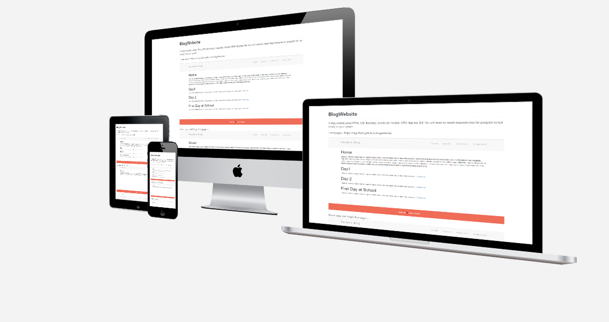
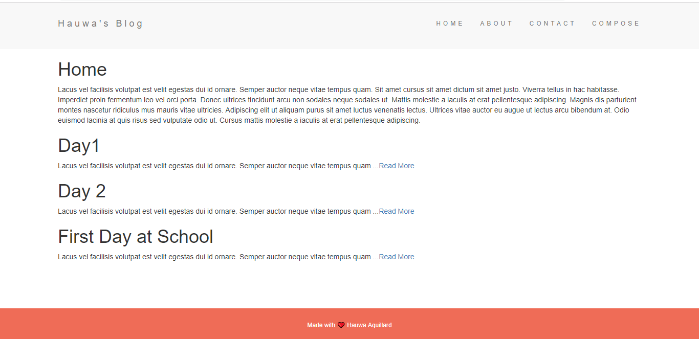
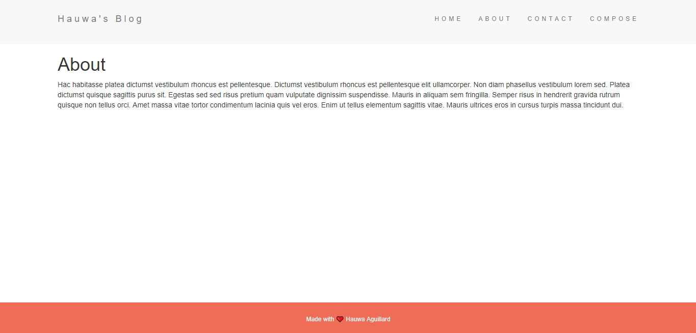
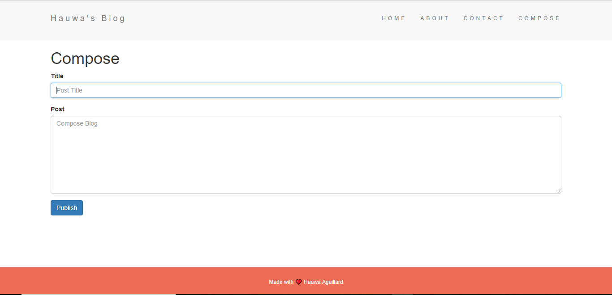
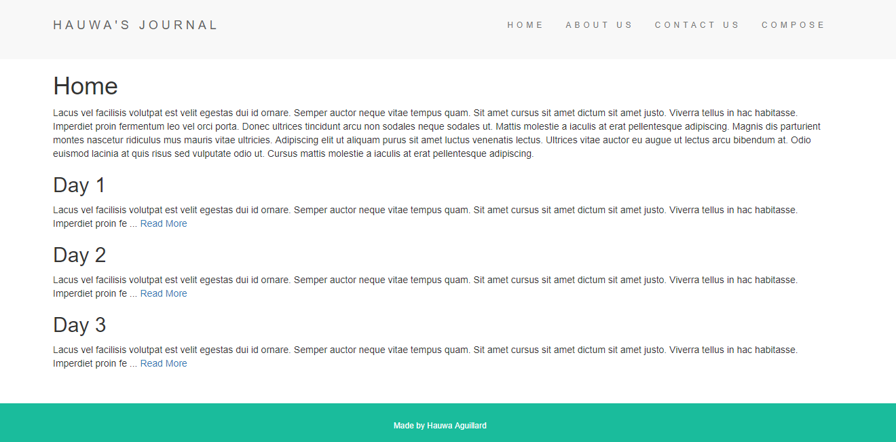

# BlogWebsite
A blog website using HTML, CSS, Boostrap, JavaScript, Nodejs, NPM, Express, EJS. You will need to install dependencies for program to run locally on your system

Homepage--> https://haguillard.github.io/BlogWebsite/

About page and Single Post page-->

Compose Blog Page --> 
      

Updated Blog Theme --> 

